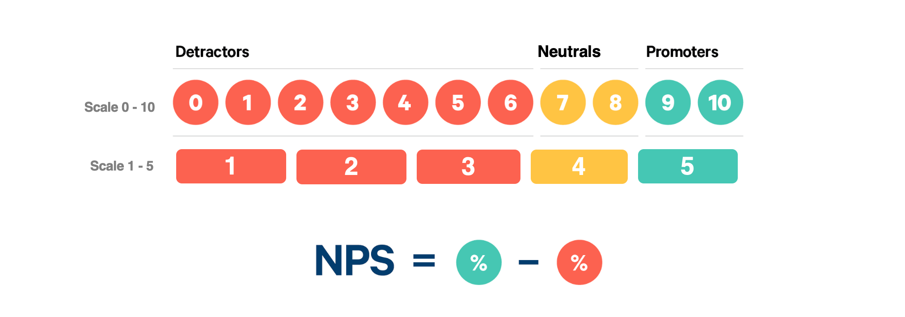
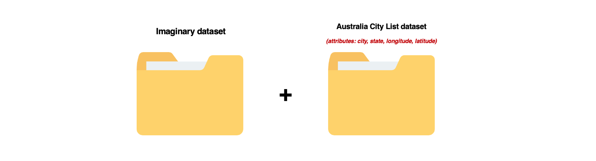
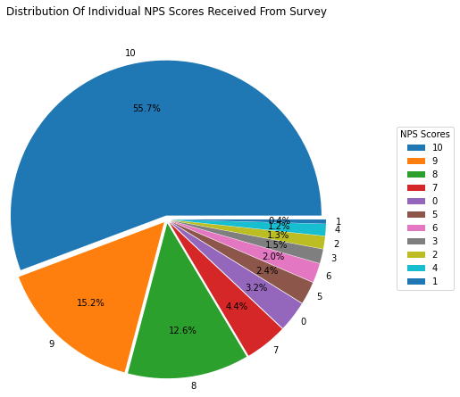
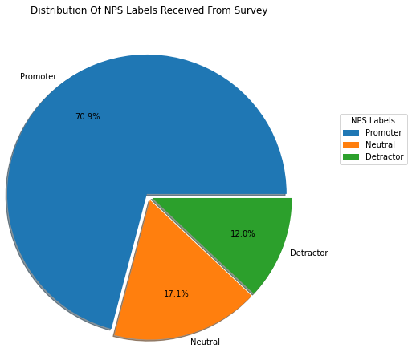
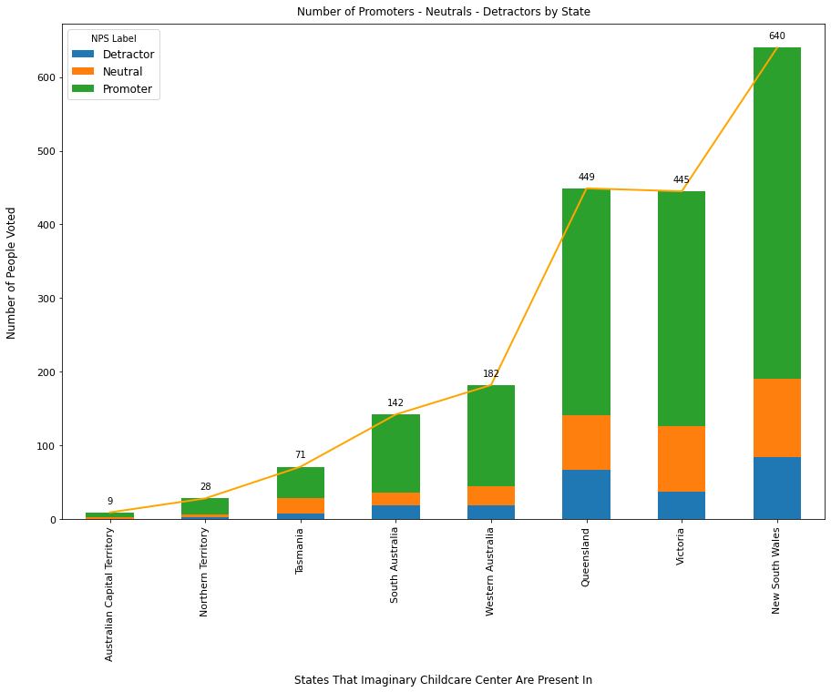
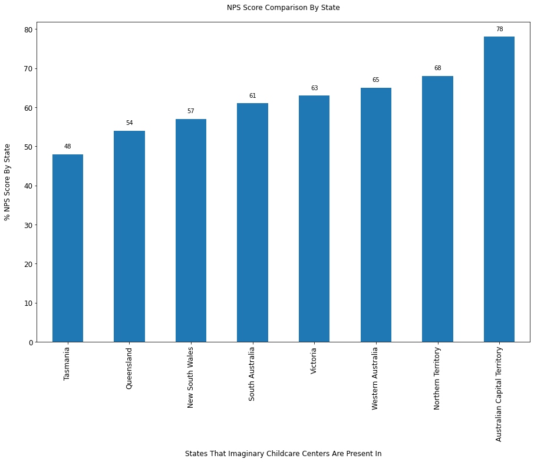
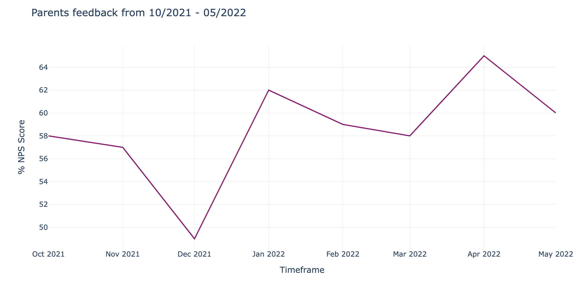
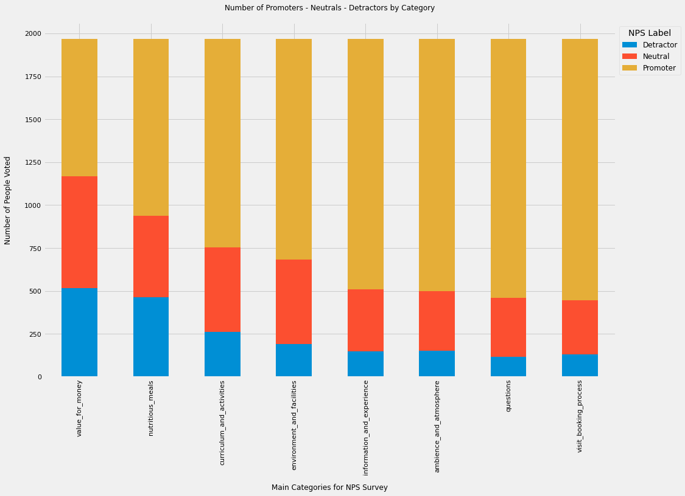
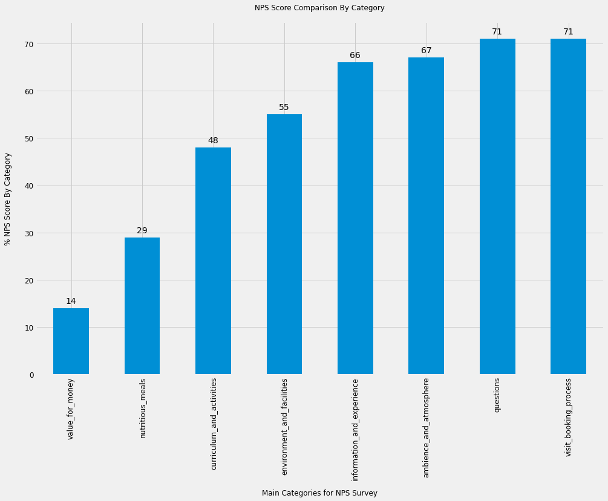
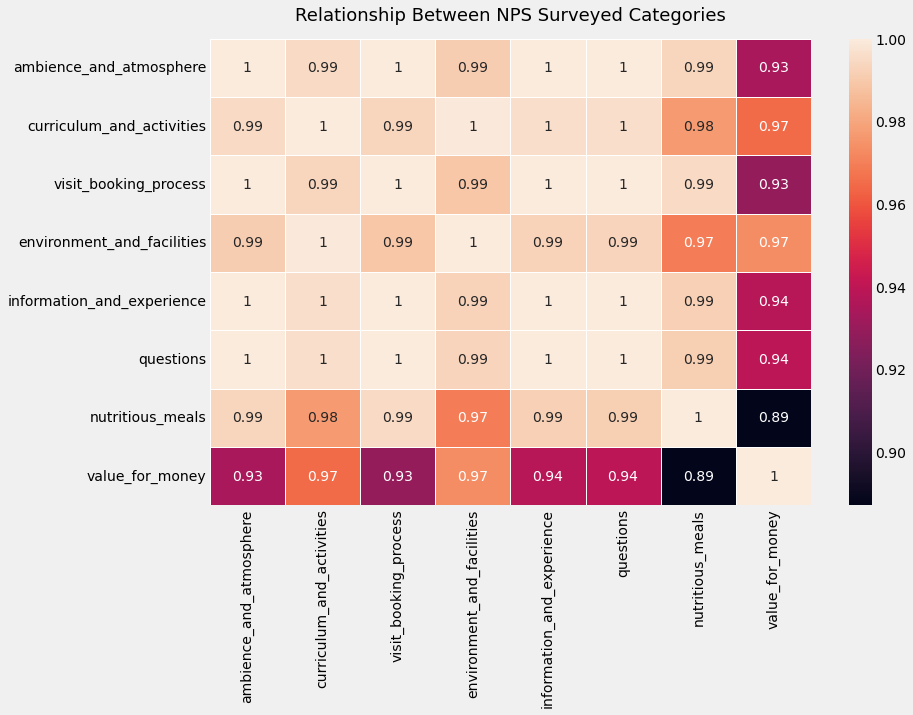

# An analysis on customer loyalty and satisfaction through NPS survey post Covid-19 pandemic of Imaginary Childcare

## Disclaimer
- Due to the lack of information on the assigned organization and the data acquisition approach, the author actively generalised Imaginary as a fiction childcare center and made several assumptions regarding the business and the data in order to move forward with the analysis process. <strong>Please use the insights derived from this notebook for reference purposes only.</strong>

- Author: Wendy Ha (wendyha.sut@gmail.com - 0402384850). 

Check more of my personal projects at: https://wendy-ha-portfolio.netlify.app/

## Introduction
### Net promoter system
Net Promoter Score (NPS) is a simple method of measuring the overall likelihood of a customer to recommend a product, service or company to a friend or family's member. 

In this analysis, the Net Promoter Score (NPS), on a scale from 0 to 10, evaluates the likelihood that parents would recommend Imaginary Childcare services at centres around Australia to their colleagues or friends.

* Customers who score 9 and 10 are classified as Promoters
* Customers who score 7 and 8 are classified as Neutral/Passive
* Customers who score 0 and 6 are classified as Detractors 

To calculate NPS: <strong>NPS = (Promoters - Detractors)/Total ratings * 100</strong>

### Problem statements
The purpose of this notebook is to assist Imaginary Childcare's managers in assessing the factors impacting the level of parents and children's satisfaction after using their services, particularly in the post COVID-19 period. Imaginary Childcare is anticipated to make reasonable modifications to its business strategy based on the analysis's findings in order to increase its Net Promoter Score (NPS) and customer recommendation.

The intended objective can be achieved by responding to the following questions:

#### PART A: Geographic Analysis
- Q1: Among eight states and territories of Australia (New South Wales, Queensland, Victoria, Western Australia, South Australia, Tasmania, Northern Territory, Australian Capital Territory), which one had the highest number of respondents to the Imaginary Childcare NPS survey?
- Q2: How children and parents' satisfaction vary by states and cities?

#### PART B: Behavioral Analysis
- Q3: Has the satisfaction of parents and children at Imaginary Childcare centres improved over the period of 08 months, from 10/2021 to 05/2022?
- Q4: Which category has the highest and lowest NPS score among the following eight: Ambience And Atmosphere, Curriculum And Activities, Visit Booking Process, Environment And Facilities, Information And Experience, Questions, Nutritious Meals, and Value For Money?

### Concatenating new dataframe
The Imaginary's NPS survey, as previously discovered, spanned too broad, with 25 local government areas and 333 cities across Australia, making spatial analysis difficult. Therefore, it is necessary to scale down areas by transforming cities into states to which they belong.

In the following steps, I will merge an AU city database (https://www.kaggle.com/datasets/maryamalizadeh/worldcities-australia) covering 1,035 prominent cities in Australia with associated <strong>latitude, longitude, and state</strong> of each city into the Imaginary dataset in order to generate a new dataframe for geographic analysis.

## Exploratory Data Analysis
"In Overall: Parents are Happy!"

- Distribution of Individual NPS Scores received from survey

- Distribution of NPS Labels received from survey

>**Findings:** Parents' satisfaction with Imaginary Childcare's services was quite high throughout the post-COVID-19 period (from October 2021 to May 2022), as seen by the two pie charts above. More than 70% of survey respondents are Promoters, and 55.7% indicated they were extremely satisfied with Imaginary Childcare (rated 10 point).
This satisfaction comes in part from the government's financial assistance to families through the **Child Care Subsidy** (https://www.servicesaustralia.gov.au/child-care-subsidy) and **COVID Child Care Support packages** (https://www.education.gov.au/covid-19/announcements/covid-19-update-australian-government-support-child-care). Moreover, state governments have a multitude of programs to develop qualified staffs in the Early Childhood Education field. These efforts have contributed to an improvement in the quality of Imaginary Childcare and other childcare providers.

### PART A: Geographic Analysis
#### Q1: Which state had the highest number of respondents to the NPS survey?

>**Findings:**
- In general, with 640 respondents, NSW had the highest proportion of parents participating in the survey, accounting for more than 32%. Queensland and Victoria follow with nearly equivalent numbers of responses (449 and 445, respectively).

According to HESTA's Early Childhood Education and Care (ECEC) workforce insights in 2021, these are 03 states contain the majority ECEC providers in the country, ranging from large providers (who operate more than 25 services) to single service providers. As a result, the 03 most important regions impacting Imaginary Childcare's business strategy are New South Wales, Victoria, and Queensland.

- In terms of Detractors rate, Queensland has the greatest proportion of Detractors among respondents with 14.2% (67 out of 449 respondents were Detractors), while NSW had 13.1% (84 Detractors out of 640 respondents) and the Northern Territory had 10.7% (3 Detractors out of 28 respondents).

The gap in satisfaction with Imaginary services between states can be explained by differences in human resource allocation as well as states government investment for the ECEC industry. New South Wales and Victoria attract the biggest number of ECEC professionals in Australia, including: Early Childhood Educators, Administration/Management, Family Day Care Workers, Kindergarten Teachers, Out of School Hours Care Workers, etc (HESTA 2021). For example, from June 2022, Victoria's TAFE system is helping to deliver the workforce for this industry by offering tuition fee-free training for Certificate III in Early Childhood Education and Care, while New South Wales commits $24.7 million over 04 years, starting from 10/2022, to The Childcare and Economic Opportunity Fund to increase access to and affordability of ECEC services.

- Tasmania is the state with the biggest neutral rate, with nearly 30% of survey respondents expressing neutral opinion (21 out of 42). On the other hand, the Detractors rate in this state is currently quite high; therefore, if Imaginary Centers intend to increase their NPS Score in this region, they must devise a strategy to convert these Neutral people to Promoters as soon as possible, before they become Detractors.

#### Q2: How children and parents' satisfaction vary by states and cities?
##### In terms of State

>**Findings:**

- The ACT has the highest NPS score of 78%, followed by the Northern Territory (NT) with a score of 68%. Due to the limited number of survey respondents in these two states (only 9 and 23 people respectively), it is not possible to conclude that the quality of Imaginary Childcare in the ACT and Northern Territory is better to that of other states.

- Tasmania has the lowest NPS score due to the significant number of detractors, as analysed above. In addition, the 03 primary regions of Imaginary Childcare's business: Queensland, New South Wales, and Victoria need strategies to raise the number of Promoters and decrease the number of Detractors.

##### In terms of City

>**Findings:**

- The Choropleth Maps above depicts the cities where Imaginary Childcare's customers reside. It highlights an intriguing fact is that even if the parents live in the same area and utilise the same service, their experiences and ratings are vastly different.

- For instance, five customers from Queenstown, Tasmania send their children to a Imaginary Childcare Center in this city. However, only 2 of 5 would strongly recommend Imaginary services, 1 customer gave a neutral rating of 8 points, 1 customer gave negative feedback of 6 points, and 1 customer was extremely unsatisfied with the service and gave a rating of 2 points.

To understanding why their rating differ despite having the same geographic background, additional demographic research is potentially required.

### PART B: Behavioral Analysis
#### Q3: How customer feedback varied throughout the course of eight months, from 10/2021 to 05/2022

>**Findings:**
- We can divide the Imaginary feeback time into two distinct evaluation periods. The first phase of the study covers the post Pandemic period from October 2021 to December 2021. The second phase comprises the new normal period from January to May 2022.
>**(1) In the post COVID-19 period (10/2021 - 12/2021):**

Imaginary Childcare's NPS has decreased from 58% in October 2021 to 49% in December 2021. This is due to the fact that after October 2021, numerous Australian States have officially lifted their COVID-19 lockdowns, including New South Wales on 11 October 2021 and Victoria on 21 October 2021. As more parents returned to work, the number of children enrolled in childcare grew, the workforce is experiencing a serious shortage after COVID-19. The overload at many centres has a negative impact on service quality, which in turn affects the experience and satisfaction of parents.

>**(2) In the new normal period (01/2022 - 05/2022):**

In the first half of 2022, Imaginary Childcare's NPS Score increased significantly compared to the period in 2021. This is due to the fact that the Australian government has decided to **reopen its borders** (https://www.bbc.com/news/world-australia-60284491) to international travel in February 2022, allowing many ECEC professionals who are foreigners to return to Australia and continue working. In addition, the government maintains the **Child Care Subsidy** (https://www.servicesaustralia.gov.au/child-care-subsidy) and continues to extend the **Childcare Support package for COVID-19** (https://www.education.gov.au/covid-19/announcements/covid-19-update-australian-government-support-child-care) until June 30, 2022. As a result, the human resource crisis and financial concerns in the ECEC industry have been partially resolved, which has contributed to an improvement in service quality at the facilities.

Consequently, the level of parents satisfaction increases.

#### Q4: Which category has the highest and lowest NPS score among the 8 surveyed categories?

>**Findings:**

- The categories with the highest NPS Score are "Visit Booking Process" and "Question". These are the two services with the highest Promoters, 1519 and 1506, and the lowest Detractors, 130 and 116, respectively. This demonstrates that Imaginary has been efficient in terms of administration and customer support.
- The categories with the poorest NPS scores are "Value for money" and "Nutritious Meal". This indicates that parents' primary concern while enrolling their children to Imaginary Childcare centres is the Tuition Fee and the Children's Nutrition.

>**Findings:**

- The heatmap depicts the relationship between categories. It can be seen that "Value for Money" has a positive relationship with factors such as "Nutritious Meal" (0,89), "Ambience and Atmosphere" (0,93), and "Visit Booking Process" (0,93), however the relationship is not very strong.
This demonstrates that while parents may believe that the amount of money they spend for the center's services is increasing, but the nutrition in the food, the cleanliness of the facility, and the booking service are not providing appropriate value for the money invested.
